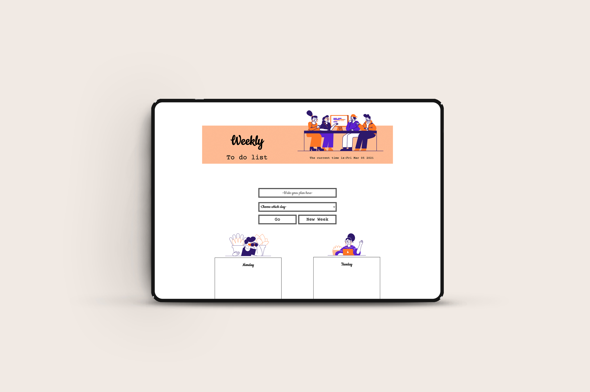

## JS To do list
- [X] This application allows users to make a weekly to do list. They can type what kind of plan, choose which day and press go button. Users can mark which one is done, as well as delete a plan. They can also click new week button to clean up all the plans.
- [X] Here is the live side https://shimengpan.website/JS-todolist/index.html
- [X] Here is the video link https://share.vidyard.com/watch/UBntt9nJ3KFNkiTZNZu5Lj
